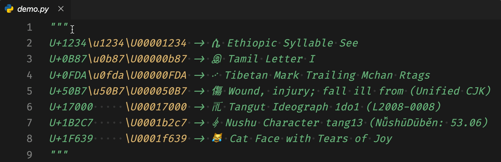

# UnicodeHover



[](https://circleci.com/gh/jamesohortle/UnicodeHover/tree/master)

UnicodeHover lets you see a glyph of the character represented by a Unicode escape. Let's say you have a regex to remove all non-printable characters, such as `DEL`.

```python
unprintables = re.compile(r"[\u0000-\u001f]")
```

Or perhaps your coworkers don't have the necessary fonts to display glyphs and have used escapes so that their editors don't show them [_mojibake_](https://en.wikipedia.org/wiki/Mojibake) or � (`U+FFFD`).

In any case, it would be handy to immediately have information on the characters being processed instead of, e.g., going to an external website and searching for the codepoint.

## Usage/Features

Simply place your cursor over the escape sequence and a panel will hover over it, showing you the glyph in question.

- Recognizes the code points as used by the Unicode Consortium (`U+` followed by 4 to 6 hexadecimal digits) in any file.
- Recognizes Unicode escape sequences in Python, JavaScript (TypeScript) and (La)TeX files.
- Renders a glyph of the character using a system font (see [Requirements](#requirements)).
- Provides a one-line description of the character in English.
- Provides a link to the [Unicode Table](https://unicode-table.com) page (no affiliation) for the character for further information.

## Requirements

- Works on Python, JavaScript, TypeScript or TeX files.
- TeX files requires [LaTeX Workshop](https://github.com/James-Yu/LaTeX-Workshop) to be installed.
- Needs a system font that defines a glyph for the character to be displayed.

## Known Issues

Pull requests (in particular for new languages) are welcome.

- Non-printable characters, by definition, do not normally have glyphs associated with them and so no glpyhs will be displayed. However, the description and link will still be shown.
- On Mac, even if, e.g., `Apple Color Emoji` font is installed, no glyph or a box is shown.
- [LaTeX Workshop](https://github.com/James-Yu/LaTeX-Workshop) is required for .tex files.

## Release Notes

### 0.0.1

Alpha!

## About the icon.

The character in the icon is `U+1234 ETHIOPIC SYLLABLE SEE`, which is part of the Geʽez script used for several Ethiopic languages, in particular Amharic. Although `SEE` is most likely pronounced `seː`, it represents the idea that you can "see" glyphs as easily as 1, 2, 3(, 4). It also just looks pretty!