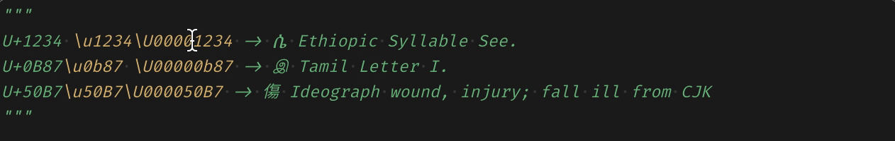

# UnicodeHover



UnicodeHover lets you see a glyph of the character represented by a Unicode escape. Say you wanted to create a set of all punctuation in Unicode. One (unsightly) way of doing it is as follows.
```python
import string
from itertools import chain
punctuation = \
      set(string.punctuation) | \
      set("！＂＃＄％＆＇（）＊＋，－．／：；＜＝＞？＠［＼］＾＿｀｛｜｝～、。〃〈〉《》「」『』【】〔〕〖〗〘〙〚〛〜〝〞〟｟｠｡｢｣､･゠〰⦅⦆") | \
      set("«‹»›„‚“‟‘‛”’❛❜\u275F❝❞❮❯⹂〝〞〟＂") | \
      set("\u002E\u0964\u0589\u3002\u06d4\u2cf9\u0701\u1362\u166e\u1803\u2cfe\uA4ff\ua60e\ua6f3\u083d\u1b5f\u002c\u060c\u3001\u055d\u07f8\u1363\u1808\u14fe\ua60d\ua6f5\u1b5e\u003f\u037e\u00bf\u061f\u055e\u0706\u1367\u2cfa\u2cfb\ua60f\u16f7\U00011143\uaaf1\u0021\u00a1\u07f9\u1944\u00b7\U0001039f\U000103d0\U00012470\u1361\u1680\U0001091f\u0830\u2014\u2013\u2012\u2010\u2043\ufe63\uff0d\u058a\u1806\u003b\u0387\u061b\u1364\u16f6\u2024\u003a\u1365\ua6f4\u1b5d\u2026\ufe19\u0eaf\u00ab\u2039\u00bb\u203a\u201e\u201a\u201c\u201f\u2018\u201b\u201d\u2019\u0022") | \
      set(map(chr, chain(range(0x2010, 0x2028), range(0x2030, 0x205F)))) | \
      set(map(chr, range(0x2E00, 0x2E50)))
```

Alternatively, let's say you have a regex to remove all non-printable characters, such as `DEL`.

```python
unprintables = re.compile(r"[\u0000-\u001f]")
```

Maybe your coworkers don't use VS Code and have used escapes so that their editors don't show them [_mojibake_](https://en.wikipedia.org/wiki/Mojibake).

In any of the above cases, it would be handy to immediately have information on the characters being processed instead of, e.g., going to an external website and searching for the codepoint.

## Features

Simply place your cursor over the escape sequence and a panel will hover over it, showing you the glyph in question.

## Requirements

- Works on Python, JavaScript or LaTeX (TODO: will it work without LaTeX-Workshop?) files.
- A font that defines a glyph for the character to be displayed.


## Extension Settings

TODO

## Known Issues

TODO

## Release Notes

Users appreciate release notes as you update your extension.

### 0.0.1

Alpha!

